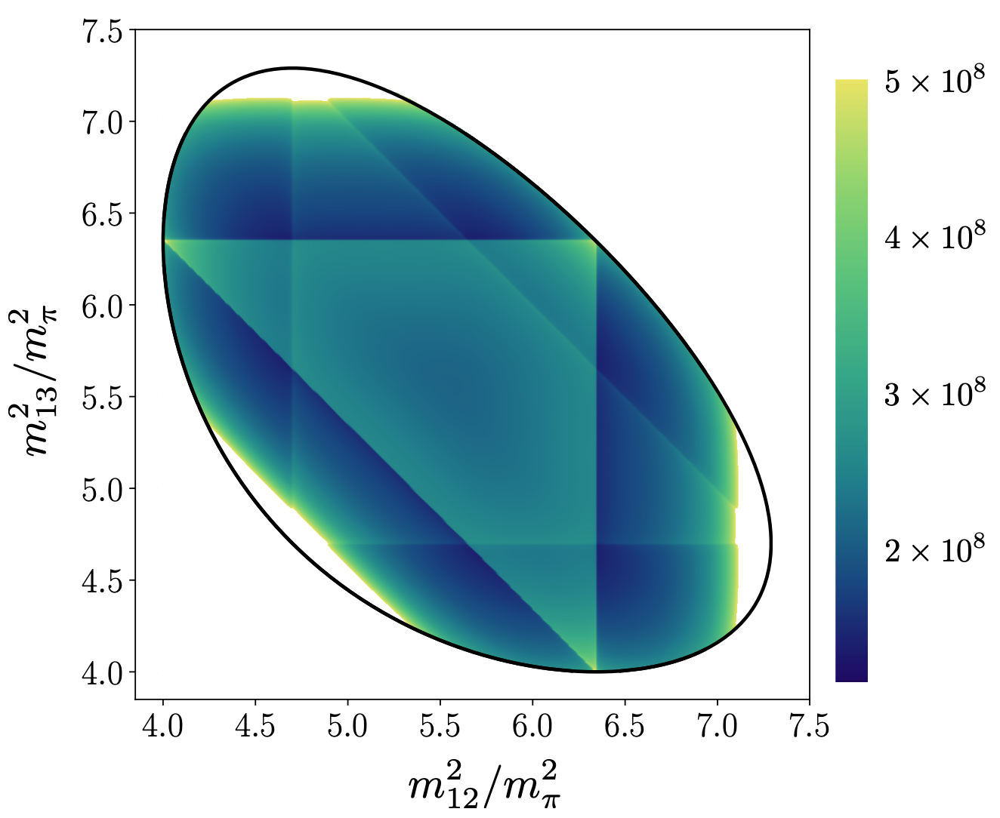

This is an informal summary of: [_The energy-dependent $\pi^+ \pi^+ \pi^+$ scattering amplitude from QCD_](), published in [PRL](<https://journals.aps.org/prl/abstract/10.1103/PhysRevLett.126.012001>). In some ways, this work represents the culmination of a many-year effort going back to my PhD thesis in 2014. The focus is to predict the scattering amplitude that describes the process
$$ \pi^+(p_1)   \pi^+(p_2)   \pi^+(p_3)   \to   \pi^+(p_1')   \pi^+(p_2')   \pi^+(p_3') .$$
Roughly speaking, this represents the scattering of three pion beams, with incoming momenta $p_1$, $p_2$ and $p_3$, into a different outgoing three-pion state, detected to have momenta $p_1'$, $p_2'$ and $p_3'$.

The scattering amplitude, denoted by $\mathcal M_3$, is the key observable describing this process. It can be used to predict the probability that a given incoming three-pion configuration transitions to a particular outgoing configuration. These probabilities can be represented using plots like that shown above (depicting $\vert \mathcal M_3 \vert^2$). Here we have fixed everything besides two parameters representing the outgoing pion momenta. The yellows and greens in the shading here indicate regions in momentum space where the outgoing transition is more likely.

In this case the more likely regions are not so much due to the details of the interactions, but instead are due to the combinations of momenta. We say the enhancements are kinematic rather than dynamical effects. In future studies of $3 \to 3$ scattering, involving particles with stronger interactions (or interactions with non-trivial energy dependence), one expects more complicated patterns with both kinematic and dynamical effects playing an important role. In this sense, the present study is an important benchmark on the way to a general understanding of three-(and more)-particle scattering in QCD.

Here I have said nothing about how we predicted the $3 \to 3$ scattering amplitude. In a nut-shell, the approach is to extract three-pion energies in a finite cubic volume using lattice QCD. These are then related to an intermediate quantity called a K matrix using formalism that I developed with Steve Sharpe and extended with other collaborators to more general systems. In a final step a set of known integral equations are solved to relate the K matrix to the physical scattering amplitude.

The next step in this work is to apply these approaches to more interesting three-pion systems especially those including short-lived two- and three-pion resonance excitations.
