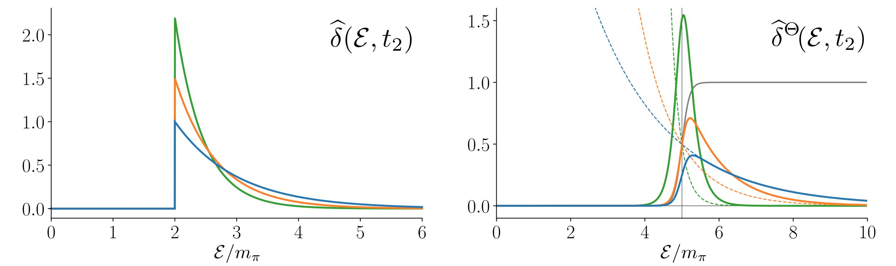

This is an informal summary of: [_Variations on the Maiani-Testa approach and the inverse problem_](). The idea of this work, completed with Mattia Bruno at CERN, is to connect some new ideas for calculating scattering amplitudes via lattice QCD with a seminal publication on the topic, the work of [Maiani and Testa](<https://www.sciencedirect.com/science/article/abs/pii/0370269390906953?via%3Dihub>) published in 1990.

The background is that numerical lattice calculations are performed with imaginary times. This is a mathematical trick that makes the calculation work, but it can severly limit the physical predictions that we can extract. In particular it challenges the determination of scattering information like the amplitude describing
$$n(p) \pi^+(k) \ \to \ n(p') \pi^+(k'),$$
the elastic scattering of a neutron and a positively charged pion.

One method for digging out such scattering amplitudes is to use the finite system size (the finite volume) as a tool to probe the multi-particle interactions. This method has proven to be incredibly powerful and is one of my major research focuses. This post, however, is about another approach.

In the case where the calculation is performed in a large spatial volume it is interesting to consider infinite-volume methods of calculating scattering quantities. Based on previous work with Harvey Meyer and Daniel Robaina, and later with John Bulava, we know that any scattering amplitude at any energy can be readily related to a spectral function $\rho(\omega)$ and that this is related to the lattice (imaginary time) correlation function $G(\tau)$ via the Laplace transform
$$G(\tau) = \int_0^\infty e^{- \omega \tau} \rho(\omega) .$$
So the challenge of inverting the Laplace transform is another perspective on bridging the gap between the numerical calculation and the experimental observable.  (To be explicit, imaginary time means replacing real $t$ with $t = - i \tau$ where $i = \sqrt{-1}$ and $\tau$ is made real so that $t$ is an imaginary number. Thus the Laplace transform above is understood with real $\tau >0$.)

Unfortunately, this is known to be both an ill-posed and an ill-conditioned problem. Thus, to make progress, we immediately accept that this cannot be achieved and instead target a smeared out version of the spectral function
$$\widehat \rho(\overline \omega, \Delta) = \int_{-\infty}^\infty d \omega \widehat \delta_{\Delta}(\omega, \overline \omega) \rho(\omega),$$
where $\Delta$ is the width of the smearing or resolution function $\widehat \delta_{\Delta}(\omega, \overline \omega)$.

The question then becomes: _Is it possible to extract a range of $\Delta$ and, by fitting to a well-motivated function, to estimate the $\Delta \to 0$ limit?_ If this is not achievable a second aim is to embrace the nonzero $\Delta$ value and understand in which cases $\widehat \rho(\overline \omega, \Delta)$ at fixed $\Delta$ can provide a useful observable itself.

In the [work with Mattia](), we were interested in connecting these ideas to the result of Maiani and Testa (MT), that Euclidean correlators only give direct access to scattering information at threshold, i.e. when the scattering particles have the minimum allowed energy. MT considered the correlator relevant for the time-like pion form factor $\gamma^\star \to \pi \pi$
$$G(\tau_1, \tau_2) = \langle \pi_{\boldsymbol {p}}(\tau_1) \pi_{-\boldsymbol p}(\tau_2) J(0) \rangle ,$$
and found that this is only useful when the pion momenta vanish, i.e. $\boldsymbol p = 0$.

The idea of our recent work is to interpret this in terms of the above figure.  The left panel represents $G(\tau_1, \tau_2) $ and the curves show the weights of energies contributing. In a nut-shell, the meaning of Euclidean time is summarized by the relation
$$\langle 0 \vert  \pi(\tau) \vert E \rangle = e^{- E \tau} \langle 0 \vert  \pi(0) \vert E \rangle  . $$
So evaluating an operator at $\tau$ amounts to weighting the states to its right with a decaying exponential of $E \tau$. These are exactly the curves plotted in the left panel, with the higher peaks correpsonding to larger values of $\tau$. (To make sense of this one must also know that we normalized each peak, i.e. divided by the area.)

The fact that the left curves peak at $\mathcal E/m_\pi = 2$ means that the correlation function is dominated by the energy $\mathcal E = 2 m_\pi$, the minimum energy that two-pions can have. This explains the MT result, the correlator only gives direct information when the pions have the minimum energy. Then to make this a physical process the minimum energy must be matched by the minimum momentum $\boldsymbol p = 0$.

To go beyond this limitation, the new idea of our work is to consider the modified correlator
$$G^{\Theta}(\tau_1, \tau_2) = \langle \pi_{\boldsymbol {p}}(\tau_1)  \pi_{-\boldsymbol p}(\tau_2) \Theta(\hat H - 2 \omega_{\boldsymbol p}, \Delta) J(0) \rangle ,$$
where $\Theta$ is a smooth step, rising from 0 to 1, shown in the right panel in light grey. This smooth step function depends on $\hat H$, the hamiltonian of the system. We proposed two methods for extracting these modified correlation functions, one based in relating it to the resolution function $\widehat \delta_{\Delta}(\omega, \overline \omega)$ and a second based in determining the low-lying energies and matrix elements and weighting them with $\Theta$.
The upshot is that this $\Theta$ shifts the energies contributing to $G$ in such a way that scattering information can be extraced away from the energy minimum.

We ran with this idea in the paper by studying the $\Theta$ insertion for both $J \to \pi \pi$ and $n \pi \to n \pi$ and showing that one can fit the lattice data to a function depending on the real and imaginary part of the physical scattering observable. As a final new ingredient, we considered the unmodified $n \pi \to n \pi$ correlator for the case when the nucleon and pion have vanishing momenta and provided new expresions for describing the scattering of these particles at the energy threshold.

Future work is needed to see how useful these ideas will be in practical calculations.
